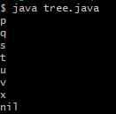

# linguagem baseada no pi calculus e um compilador para java

Trabalho desenvolvido para a disciplina Trabalho de conclusão de curso, do curso ciência da Computação, da Universidade Federal de Pelotas. Nesse trabalho, foi desenvolvida uma linguagem de programação baseada no Pi Calculus e um compilador que traduz essa linguagem para java. Esse repositório contém exemplos de programas escritos na linguagem criada e o código fonte do compilador.

# Pré-requisitos

Como pré-requisito, é necessário ter instalado uma versão java superior ou igual à 13.0.1. Também é necessário ter o javacc instalado, lembrando que os testes foram feitos com a versão 5.

# Como rodar

Executar arquivos *make.sh* nos diretórios a seguir:

1. [CompiladorPiCalculus/compiler/pilang/java/pilang/src/](CompiladorPiCalculus/compiler/pilang/java/pilang/src/)
2. [CompiladorPiCalculus/compiler/pilang/](CompiladorPiCalculus/compiler/pilang/)

Após gerados os *.class*, basta rodar o arquivo *pilang.class* para utilizar o compilador. O método main recebe como argumento uma string, que será o nome do arquivo *.java* gerado após compilação. Caso o programa esteja sendo executado em um terminal unix, os comandos abaixo apresentam um exemplo de compilação nesse ambiente:

> java pilang test < pi/tree.pi

O arquivo *.java* gerado ficará armazenado na pasta [java](CompiladorPiCalculus/compiler/pilang/java). Para testar o exemplo, basta executar, dentro desse diretório:

> java test.java

Após rodar o programa, a saída da imagem abaixo deverá ser impressa:

